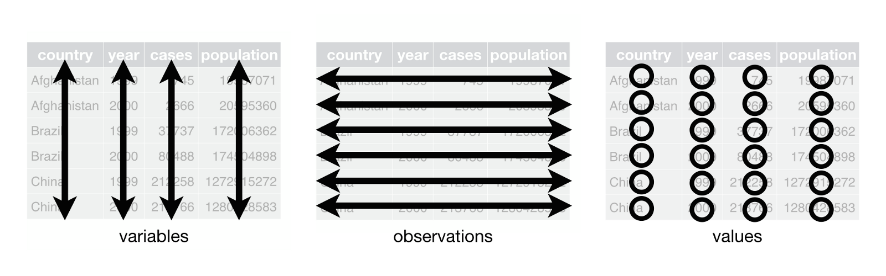

The tidyverse is a collection of packages that can easily be installed with a single “meta”-package, which is called “tidyverse.” This provides a convenient way of downloading and installing all tidyverse packages with a single R command:

```{r,eval=FALSE}
install.packages('tidyverse')
```

```{r}
library(tidyverse)
```

---


---
# Datascience workflow in R


---
# Data tidying with tidyr
It is often said that 80% of data analysis is spent on the cleaning and preparing data. And it’s not just a first step, but it must be repeated many times over the course of analysis as new problems come to light or new data is collected. 


The principles of tidy data provide a standard way to organise data values within a dataset. A standard makes initial data cleaning easier because you don’t need to start from scratch and reinvent the wheel every time. The tidy data standard has been designed to facilitate initial exploration and analysis of the data, and to simplify the development of data analysis tools that work well together. 


---

- The goal of tidyr is to help you create tidy data. Tidy data is data where:

1. Every column is variable.
2. Every row is an observation.
3. Every cell is a single value.



 We will explore four function from the tidyr  pacakage:


.pull-left[

- pivot longer
- pivot wider
]

.pull-right[
- separate
- unite
]

---
# Learning Outcomes
- ~~**import csv and excel files into R**~~
- ~~**Write csv and excel file out of R**~~
- Introduction to tidyr
- pivot_longer and pivot wider function
- seperate and unite function